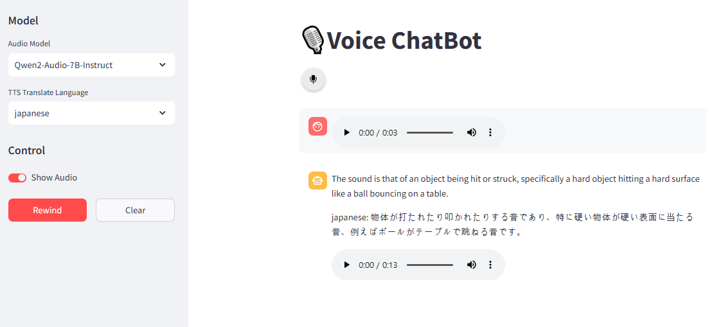

# Voice Chat Demo

Voice chat demo using Whisper and Qwen2-Audio.

- 기본 설명
> PC를 통해 내 목소리를 실시간으로 녹음 후, stt model을 통해 text 추출
> 추출 된 text를 question으로 하고 llm으로 output 받아옴
> 받아온 output을 원하는 language로 llm통해 번역
> 번역된 output을 tts model을 통해 audio 내보냄

- TTS model 설명
> tts model 중 아랍어를 사용하는 XTTS 모델의 output target voice는 5개만 사용
> `data/ttsvoice` 에 output target으로 잡을 audio파일 넣으면 작동
> 실험에 사용한 데이터는 ai-hub 모델 data라 local 저장되어 있음. 
> 연예인이나 성우의 voice 파일 또는 자기자신의 voice로도 output이 나오게 가능



## Enviroments
```bash
conda create -n voice
conda activate voice
```

### Linux
- cpu
```bash
sudo apt update
sudo apt install ffmpeg
sudo apt install portaudio19-dev
sudo apt install gcc
pip install audiorecorder
pip install -r requirements_cpu.txt
```

- gpu
```bash
sudo apt update
sudo apt install ffmpeg
sudo apt install portaudio19-dev
sudo apt install gcc
pip install audiorecorder
pip install -r requirements.txt
```


### MacOS
```zsh
brew install ffmpeg
brew install portaudio
pip install audiorecorder ffmpeg-python
pip install -r requirements_macos.txt
```

## Run

```bash
streamlit run web_app_asr.py
streamlit run web_app_chat.py
```

## tts model
### bark [url](https://huggingface.co/suno/bark)

- sample notebooks[notebooks](notebooks/tts/bark.ipynb)

**language 지원**
- 한국어 O ko
- 일본어 O ja
- 영어 O en
- 아랍어 X

**tts 성능**
- 어색하지 않은 것 같다.

### fish-speech [url](https://github.com/fishaudio/fish-speech/tree/main)

- sample notebooks errors[notebooks](notebooks/tts/fish-speech.ipynb)

**현재 target voice의 path읽는 곳에서 에러 절대경로로 해도 에러 발생**

**language 지원**
- 한국어 O
- 일본어 O
- 영어 O
- 아랍어 O

### XTTS_v2

- pip install coqui-tts
- pip install hangul-romanize # korean
- sample notebooks[notebooks](notebooks/tts/XTTS-v2.ipynb)

**language 지원**
- 한국어 O ko
- 일본어 O ja
- 영어 O en
- 아랍어 O ar

**tts 성능**
- 한국어 + 영어와 같이 섞여있는경우 묵음 처리됨. 일단 아랍어에만 적용


모델 change시 현재 memory cache 문제 해결 필요